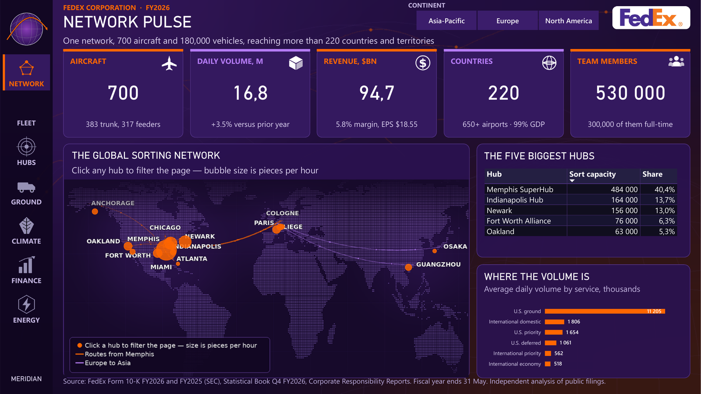
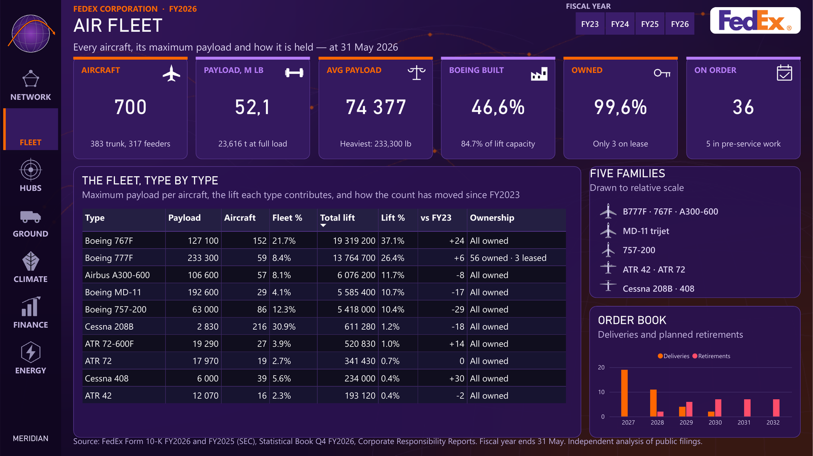
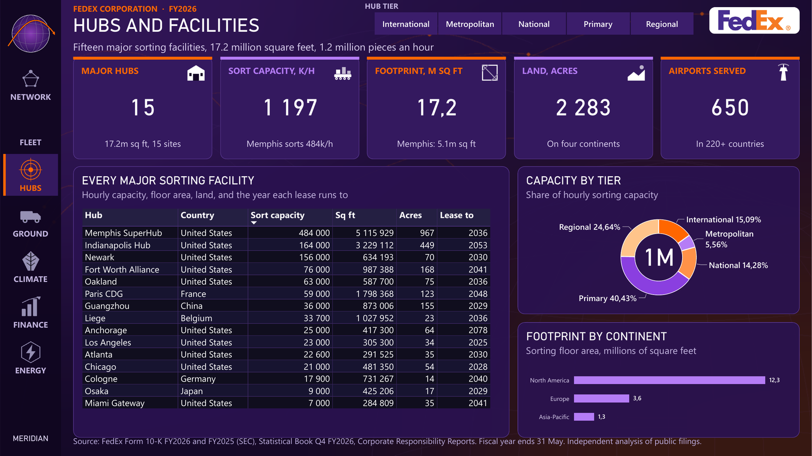
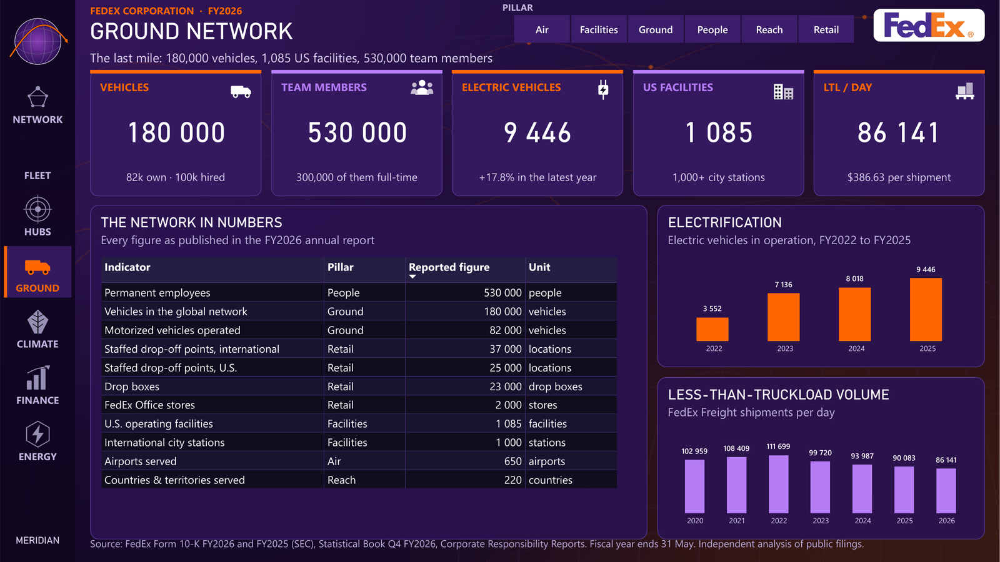
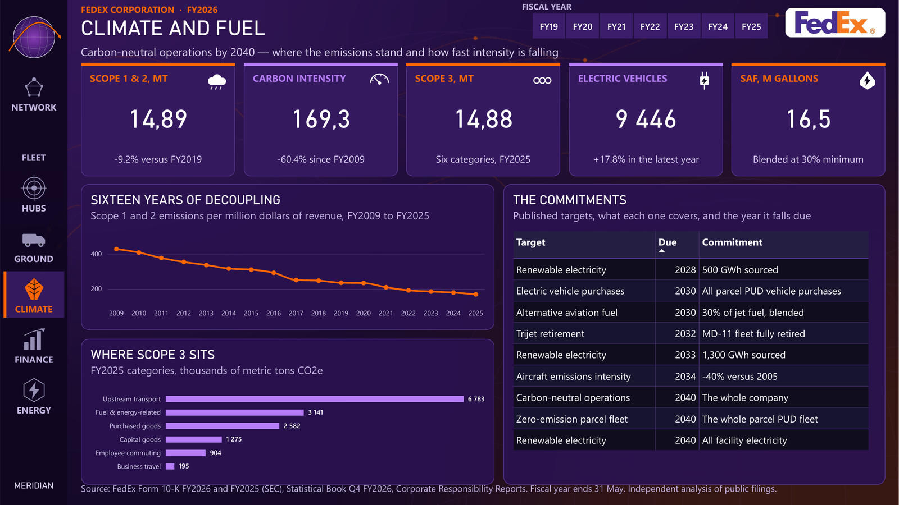
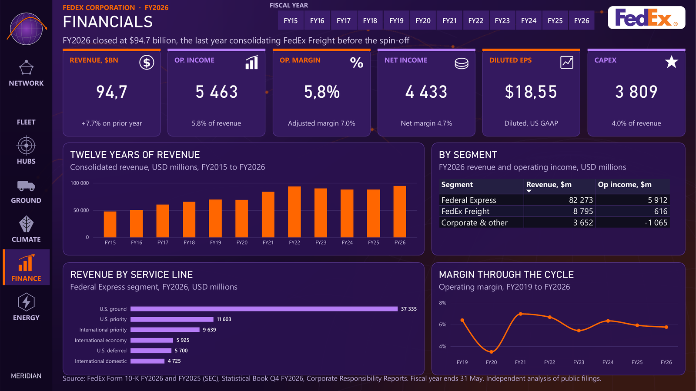
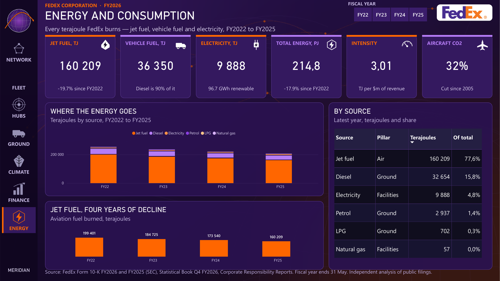
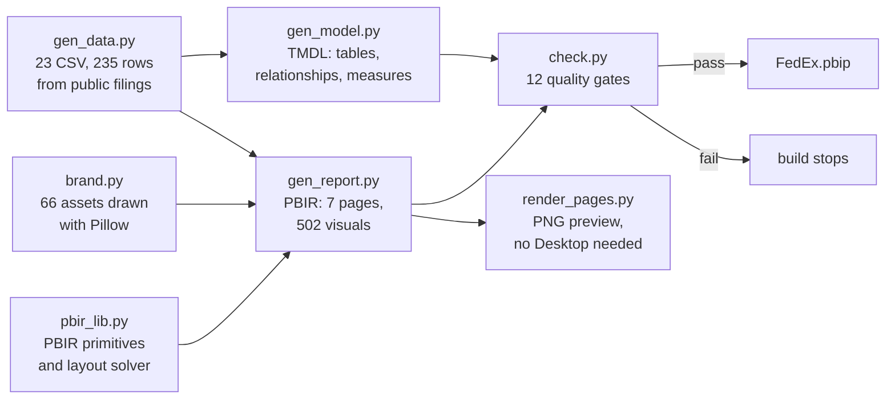
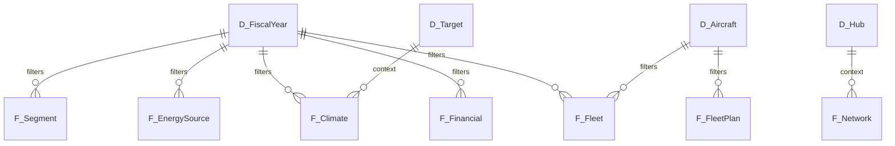

<div align="center">

# MERIDIAN · FedEx Global Network Intelligence

**A seven-page Power BI report on FedEx Corporation, generated entirely from Python.**

No visual was ever dragged onto a canvas. Every page, every measure and every pixel is
produced by a build script, checked by an automated gate, and versioned as plain text.

[](https://github.com/abdoulhamiddiallo/fedex-powerbi/actions/workflows/build.yml)
[](https://learn.microsoft.com/power-bi/developer/projects/projects-overview)
[](https://learn.microsoft.com/power-bi/developer/projects/projects-report)
[](https://learn.microsoft.com/analysis-services/tmdl/tmdl-overview)
[](https://www.python.org/)
[](LICENSE)

</div>



<details>
<summary><b>The six other pages</b></summary>

| | |
|---|---|
|  |  |
|  |  |
|  |  |

</details>

---

## Why this is not a `.pbix`

A `.pbix` is a binary. You cannot diff it. You cannot review it. You cannot explain, six
months later, why a column ended up 148 pixels wide.

This project treats a Power BI report the way a software team treats an application.

| | Clicked in Desktop | This repository |
|---|---|---|
| Report definition | one binary blob | **PBIR JSON**, one file per visual, readable in a pull request |
| Semantic model | one binary blob | **TMDL**, 24 tables and 183 measures as text |
| Layout | positioned by hand | **computed**, from the data itself |
| Quality control | the author's eye | **`check.py` fails the build** on truncated text or a broken reference |
| Reproducibility | none | one command rebuilds all 502 visuals |
| Continuous integration | not possible | every push rebuilds from scratch and asserts the result is identical |

The whole report is 3 668 lines of Python. Delete the `.Report` and `.SemanticModel`
folders, run the chain, and you get back **632 byte-identical files**. That figure is
measured on every push, not claimed once in a README.

---

## The report

| Page | What it answers |
|---|---|
| **Network Pulse** | Where the network reaches, and how much moves through it |
| **Air Fleet** | Every aircraft type, its payload, and how it is held |
| **Hubs and Facilities** | Fifteen sorting facilities, their capacity, floor area and lease horizon |
| **Ground Network** | The last mile: vehicles, facilities, people |
| **Climate and Fuel** | Scopes 1, 2 and 3, carbon intensity, and the dated commitments |
| **Energy and Consumption** | Every terajoule burned, by source and by year |
| **Financials** | Twelve years of revenue, the segments, margin through the cycle |

**502 visuals · 24 tables · 183 DAX measures · 14 relationships · 66 generated assets**

---

## Architecture



### The star schema



Four conformed dimensions, nineteen fact tables, and one `Metrics` table that holds all 183
measures and no columns at all. Every relationship is single-direction and many-to-one.
There is no bidirectional filter anywhere, and therefore no ambiguous path.

Full detail lives in [ARCHITECTURE.md](docs/ARCHITECTURE.md).

---

## Three problems worth reading the code for

### The fiscal-year pattern

Each fact table holds several fiscal years, so a bare `SUM` returns the sum of all of them.
That is 2 796 aircraft instead of 700. One pattern solves it everywhere:

```dax
Aircraft =
VAR y = MAX ( F_Fleet[FiscalYear] )
RETURN
    CALCULATE ( SUM ( F_Fleet[Aircraft] ), F_Fleet[FiscalYear] = y )
```

Unfiltered, it returns the latest year. Inside a year slicer, it follows the selection.
Inside a chart sliced by year, it follows each column. One pattern, 183 measures, no
exceptions.

### A world map that owes nothing to Bing

The Bing map visual needs a network round-trip, renders in its own visual language, and
cannot be styled to match anything. This map is two layers that share a single projection
constant.

The backdrop is a PNG drawn with Pillow: a dot-matrix planisphere sampled at one degree
from `global-land-mask`, Bézier route arcs, and hub labels placed by collision avoidance
across eight candidate positions at four distances.

Over it sits a transparent `scatterChart` whose axes are bounded to those very same four
numbers. Because the drawn projection is linear in longitude and latitude, a linear scatter
aligns exactly. The bubbles are real data points: they resize with sort capacity, respond to
the continent slicer, carry tooltips, and cross-filter the page on click. No tiles, no
telemetry, no latency.

### Layout as a solved problem

Column widths, row spacing and panel fill are calculated rather than chosen. `fitw()`
widens any column too narrow for its header or for its longest real value. Text columns are
measured against the CSV. Measure columns are measured against strings read from the live
model over XMLA and frozen in `rendered_values.json`, because a value like
`"56 owned · 3 leased"` exists nowhere in the source data.

Row spacing is derived from the panel height, so every table fills between 87 % and 96 % of
its frame. Full enough to look deliberate, with enough headroom that Power BI never adds a
scrollbar.

---

## The quality gate

`check.py` runs before every delivery and exits non-zero on any failure.

```
  183 measures and 148 columns in the model
  0 broken DAX references
  502 visuals referencing 98 measures and 41 columns, 0 missing
  0 card texts too wide (69 values read from the live model, 0 not read)
  0 visual titles too wide
  0 decimal font sizes
  0 table columns too narrow
  0 tables leaving their panel half empty (fill 87-96%)
  0 tables that would overflow horizontally
  58 images used, 65 declared, 65 present
  0 literals with an unescaped apostrophe
  7 pages, navigation targets consistent

All checks passed.
```

Every gate exists because the matching defect shipped once and had to be found by eye.

| Gate | The bug it caught |
|---|---|
| DAX reference validation | renaming `F_Service[ADV]` silently emptied a KPI card |
| Card text width | `wordWrap` has no effect on a card value, so a long line is cut, not wrapped |
| Table column width | `"56 owned · 3 leased"` needed 172 px in a 132 px column |
| Table height | title, subtitle and header take 150 px, not 104, so every table had a scrollbar |
| Panel fill | three rows floating in a 536 px panel |
| Visual title width | a renamed panel made its own title overflow |
| Image manifest | a resource used but never registered renders as a blank rectangle |
| Integer font sizes | Power BI silently ignores a decimal font size on an axis |
| Navigation targets | a button pointing at a page that no longer exists |

---

## Data and method

Every figure comes from a document FedEx published itself: the **Form 10-K FY2026** filed
with the SEC, the **Statistical Book** for the fourth quarter, the **Corporate
Responsibility Reports** whose emissions are verified by Ernst & Young, and the **SEC XBRL
API** for the long financial series.

Seven things change how those numbers read. The fiscal year ends on 31 May. FY2026 is the
last year that consolidates FedEx Freight. Scope 2 switches from market-based to
location-based mid-series. Scope 3 is shown for one year only, because its perimeter changed
three times. FedEx publishes energy in terajoules and never in gallons. A Corporate
Responsibility report is named for the year it was published, not the year it covers. And
FY2025 volumes were restated, so this model uses the restated figures throughout.

Each of these is documented, with its consequence, in
[DATA_SOURCES.md](docs/DATA_SOURCES.md).

---

## Running it

You need Power BI Desktop with PBIP and PBIR enabled in the preview features, Python 3.11,
and two packages.

```bash
git clone https://github.com/abdoulhamiddiallo/fedex-powerbi.git
cd fedex-powerbi
pip install -r requirements.txt

cd src
python gen_data.py      # writes the 23 CSV into Donnees/
python gen_model.py     # writes FedEx.SemanticModel/ as TMDL
python gen_report.py    # writes FedEx.Report/ as PBIR, plus the 66 assets
python check.py         # 12 quality gates, non-zero exit on failure
python render_pages.py  # optional: a PNG preview of all 7 pages
```

Then open **`FedEx.pbip`** and point the `DossierDonnees` parameter at your own `Donnees`
folder, under Transform data, Manage parameters. It ships as `C:\FedEx\Donnees` and it is
the only machine-specific value in the whole project.

---

## Repository layout

```
├── FedEx.pbip                     open this
├── FedEx.Report/                  PBIR: 7 pages, 502 visuals, 66 assets
│   ├── definition/pages/p1..p7/
│   └── StaticResources/RegisteredResources/
├── FedEx.SemanticModel/           TMDL: 24 tables, 183 measures, 14 relationships
├── Donnees/                       23 CSV, 235 rows, from public filings
├── src/
│   ├── gen_data.py                the data, with every source in a comment
│   ├── gen_model.py               the TMDL writer
│   ├── gen_report.py              the seven pages
│   ├── pbir_lib.py                PBIR primitives and the layout solver
│   ├── brand.py                   every drawn asset
│   ├── check.py                   the quality gate
│   ├── render_pages.py            the headless preview renderer
│   └── rendered_values.json       strings read from the live model over XMLA
└── docs/
    ├── ARCHITECTURE.md
    ├── DATA_SOURCES.md
    └── images/
```

---

## Design

Two brand colours and nothing else: orange `#FF6600` and violet `#B57CF6`, alternating
strictly across the KPI accents, on a `#170A2B` night ground with `#2A1250` panels and
`#57368E` borders.

All 66 static assets are drawn in `brand.py`: the planisphere, the route arcs, 29 KPI
pictograms, five top-view aircraft silhouettes scaled against each other, and the MERIDIAN
mark. There is no stock imagery and no icon pack. The only imported file is the FedEx
wordmark, supplied by the project owner and used unmodified.

---

## License

MIT. See [LICENSE](LICENSE).

FedEx, the FedEx logo and all FedEx marks are trademarks of FedEx Corporation. This is an
independent analysis of public filings. It is not affiliated with, endorsed by, or sponsored
by FedEx Corporation.

---

<div align="center">

**Abdoul Hamid Diallo** · Data Engineer, Power BI and Microsoft Fabric

[LinkedIn](https://www.linkedin.com/in/abdoul-hamid-diallo-fabric-data-engineer/) · [GitHub](https://github.com/abdoulhamiddiallo)

</div>
